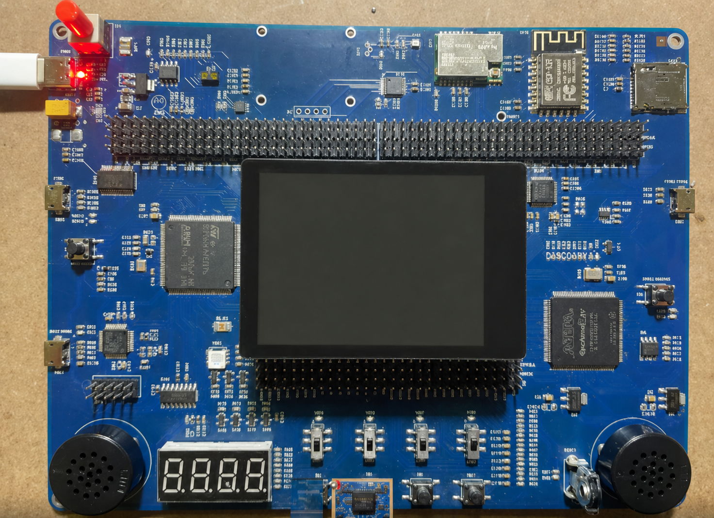
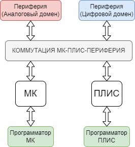
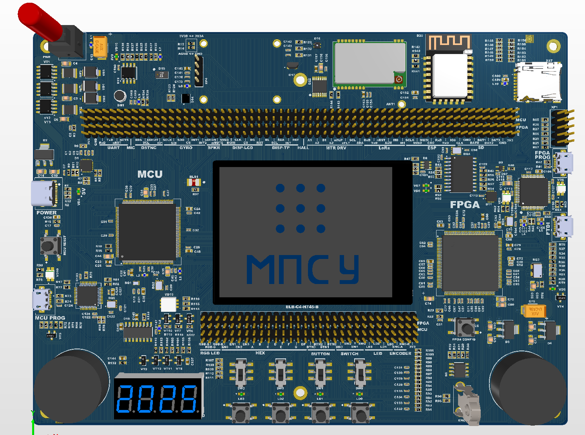
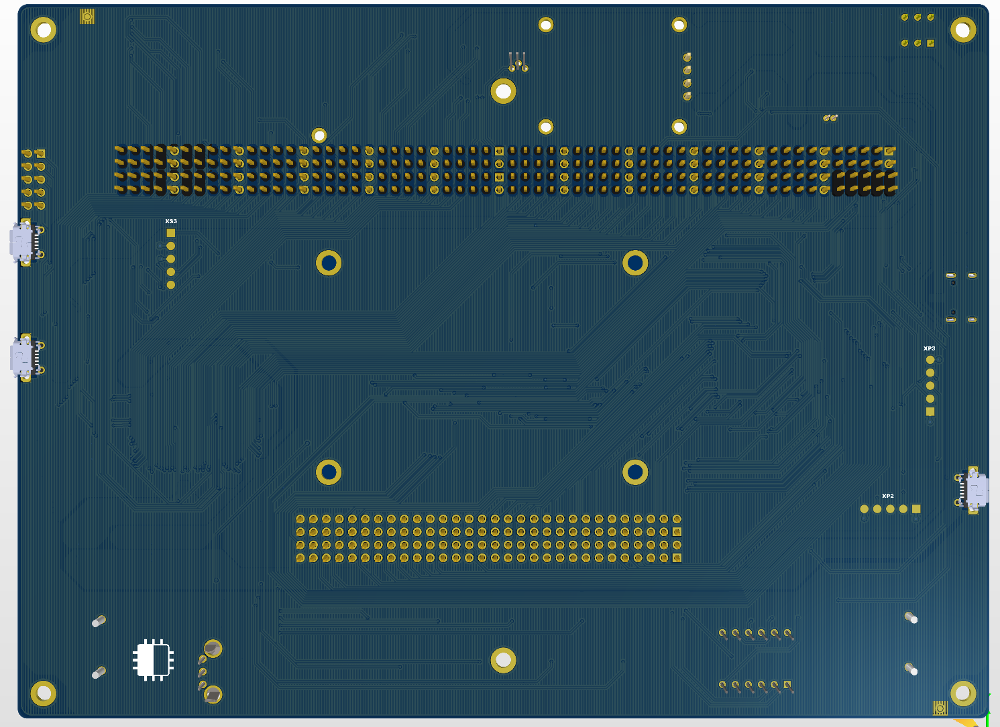

# Учебно-отладочная платформа на базе МК и ПЛИС



Проект представляет собой многофункциональную аппаратную платформу для изучения микроконтроллеров, ПЛИС, цифровых интерфейсов, датчиков и исполнительных устройств.

В основе платформы используются:

* микроконтроллер `STM32H745ZIT6`;
* ПЛИС `Intel Cyclone IV EP4CE6E22C8N`;
* встроенные средства программирования и отладки;
* система коммутации, позволяющая соединять МК, ПЛИС и периферийные устройства.

Принципиальная схема и печатная плата разработаны в Altium Designer.

## Назначение

Платформа предназначена для разработки и отладки учебных проектов, связанных с:

* программированием микроконтроллеров;
* проектированием цифровых устройств на ПЛИС;
* взаимодействием МК и ПЛИС;
* изучением цифровых интерфейсов;
* обработкой данных с датчиков;
* беспроводной передачей данных;
* управлением индикацией, звуковыми и исполнительными устройствами.

## Основные узлы



### Микроконтроллер

В качестве основного микроконтроллера используется двухъядерный `STM32H745ZIT6`.

Для его программирования и отладки на плате предусмотрен отдельный программатор на базе `STM32F103CBT6` с интерфейсом SWD.

### ПЛИС

Цифровая программируемая логика реализована на базе ПЛИС `EP4CE6E22C8N` семейства Intel Cyclone IV.

Для хранения конфигурации используется память `EPCS16SI8N`. На плате предусмотрены встроенные средства программирования ПЛИС и внешний разъём JTAG.

### Система коммутации

Отдельные листы проекта предназначены для коммутации:

* линий микроконтроллера;
* линий ПЛИС;
* общих линий МК и ПЛИС;
* периферийных устройств.

Для соединения функциональных блоков используются разъёмы `PLD-60`. Такая структура позволяет изменять конфигурацию стенда и подключать периферию к выбранному вычислительному устройству.

## Периферийные устройства

### Устройства ввода

На платформе предусмотрены:

* четыре пользовательские кнопки;
* четыре движковых переключателя;
* энкодер;
* отдельные кнопки сброса МК и ПЛИС.

### Устройства вывода

Для отображения состояния системы используются:

* четыре дискретных светодиода;
* RGB-светодиод;
* семисегментный индикатор;
* разъём для подключения дисплея.

### Датчики

Платформа содержит набор встроенных датчиков:

* `LSM6DSL` — акселерометр и гироскоп;
* `VL53L0X` — датчик расстояния;
* `ENS210` — датчик температуры и влажности;
* `CC6102` — датчик Холла.

### Аудиопериферия

Аудиотракт включает:

* микрофон;
* два динамика;
* усилитель `PAM8403`.

Микрофонный тракт относится к аналоговой части платформы, а его выход может использоваться для обработки сигнала средствами микроконтроллера.

### Беспроводная связь

Для передачи данных предусмотрены:

* модуль Wi-Fi `ESP8266`;
* модуль LoRa `E22-400T22S`;
* разъём для внешней антенны LoRa.

### Исполнительные устройства

Для управления шаговым двигателем используется драйвер `DRV8833`. Подключение двигателя выполняется через отдельный четырёхконтактный разъём.

### Хранение данных

На плате расположен разъём для карты microSD, которая может использоваться для хранения настроек, измерений и других данных.

## Цифровой и аналоговый домены

Платформа содержит цифровые и аналоговые функциональные узлы.

К цифровому домену относятся:

* МК и ПЛИС;
* кнопки и переключатели;
* светодиодная индикация;
* дисплей;
* цифровые датчики;
* модули Wi-Fi и LoRa;
* карта microSD;
* программаторы и система коммутации.

К аналоговому домену относятся:

* микрофонный тракт;
* аудиоусилитель и динамики;
* аналоговые входы и опорные цепи микроконтроллера;
* чувствительные измерительные цепи.

Разделение доменов позволяет уменьшить влияние помех, возникающих при переключении цифровых сигналов, на аналоговую часть устройства.

## Система питания

Питание платформы подаётся через разъём USB Type-C.

На плате формируются несколько напряжений питания:

* `3,3 В`;
* `2,5 В`;
* `1,2 В`.

Они используются для питания микроконтроллера, ПЛИС, периферийных устройств и внутренних банков ввода-вывода.

## Структура проекта Altium

```text
.
├── Питание #SchDoc
├── MCU #SchDoc
├── FPGA #SchDoc
├── Программатор МК #SchDoc
├── Программатор ПЛИС #SchDoc
├── Коммутация МК #SchDoc
├── Коммутация ПЛИС #SchDoc
├── Нижняя коммутация МК и ПЛИС #SchDoc
├── Устройства ввода #SchDoc
├── Устройства вывода #SchDoc
├── Разъём под дисплей #SchDoc
├── Акселерометр и гироскоп #SchDoc
├── Датчик расстояния #SchDoc
├── Датчик температуры #SchDoc
├── Датчик Холла #SchDoc
├── Микрофон #SchDoc
├── Динамики #SchDoc
├── Модуль ESP8266 #SchDoc
├── Модуль LoRa #SchDoc
├── Шаговый двигатель #SchDoc
├── Разъём для SD #SchDoc
└── Платформа #PcbDoc
```




## Используемые технологии

* Altium Designer;
* STM32;
* Intel Cyclone IV;
* цифровая и аналоговая схемотехника;
* JTAG и SWD;
* I²C, SPI, UART;
* Wi-Fi и LoRa;
* проектирование многослойных печатных плат.
